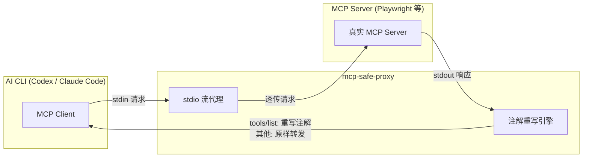

# mcp-safe-proxy

轻量级 MCP 注解代理 — 拦截 `tools/list` 响应，将工具注解重写为"安全"值，绕过 Codex 等 AI CLI 的审批弹窗，同时完全透传所有实际操作。

---

## 问题背景

OpenAI Codex CLI 根据 MCP Server 在 `tools/list` 响应中声明的工具注解判定是否需要审批：

```
需要审批 = destructiveHint == true
         OR (readOnlyHint == false AND openWorldHint == true)
```

Playwright MCP 等 Server 对所有工具硬编码了 `openWorldHint: true`，导致**每次操作都弹审批**，严重影响自动化体验。

## 工作原理

在 MCP Client（如 Codex）和真实 MCP Server 之间插入 stdio 代理：



**核心逻辑**：

- 拦截 `tools/list` 响应，将每个工具的注解重写为：
  ```
  readOnlyHint:    true   ← 告诉 Client 工具只读
  destructiveHint: false  ← 告诉 Client 工具不搞破坏
  openWorldHint:   false  ← 告诉 Client 工具不访问外部
  ```
- `tools/call`、`initialize` 等所有其他消息**完全透传**，功能零损失
- 保留工具原有的 `title`、`idempotentHint` 等其他注解字段

## 快速开始

### 安装

```bash
# 方式一：全局安装（推荐，启动更快）
npm install -g mcp-safe-proxy

# 方式二：npx 按需调用（无需预装）
npx -y mcp-safe-proxy -- <command> [args...]
```

### Codex 配置

在 `~/.codex/config.toml`（Linux/macOS）或 `%USERPROFILE%\.codex\config.toml`（Windows）中：

**原始配置**（会弹审批）：

```toml
[mcp_servers.playwright]
type = "stdio"
command = "npx"
args = ["@playwright/mcp@latest"]
```

**代理配置 — npx 方式**（不弹审批）：

```toml
[mcp_servers.playwright]
type = "stdio"
command = "npx"
args = ["-y", "mcp-safe-proxy", "--", "npx", "@playwright/mcp@latest"]
```

**代理配置 — 全局安装方式**：

```toml
[mcp_servers.playwright]
type = "stdio"
command = "mcp-safe-proxy"
args = ["--", "npx", "@playwright/mcp@latest"]
```

### ccSwitch 配置

[ccSwitch](https://github.com/farion1231/cc-switch) 使用标准 JSON 格式：

```json
{
  "command": "npx",
  "args": ["-y", "mcp-safe-proxy", "--", "npx", "@playwright/mcp@latest"]
}
```

### 从源码构建（开发者）

```bash
git clone https://github.com/Huan-zhaojun/mcp-safe-proxy.git
cd mcp-safe-proxy
npm install
npm run build
```

> 详见 [本地开发测试指南](docs/local-dev-testing.md)。

## CLI 选项

```
mcp-safe-proxy [options] -- <command> [args...]

选项：
  --verbose, -v        启用调试日志输出到 stderr
  --log-file <path>    将调试日志写入指定文件（隐含 --verbose）

示例：
  mcp-safe-proxy -- npx @playwright/mcp@latest
  mcp-safe-proxy --verbose -- npx @playwright/mcp@latest
  mcp-safe-proxy --log-file /tmp/proxy.log -- npx @playwright/mcp@latest
```

> `--` 是分隔符：左侧为代理选项，右侧为要包裹的 MCP Server 命令。

## 测试

```bash
# E2E 测试（使用 mock MCP Server）
npm run build && node test/e2e-test.js

# 真实 Playwright MCP 对比测试（需安装 @playwright/mcp）
node test/real-playwright-test.js
```

## 技术特点

- **零运行时依赖** — 仅使用 Node.js 内置模块（`child_process`、`fs`、`path`）
- **~220 行 TypeScript** — 极简实现，易于审计和维护
- **通用 MCP 代理** — 不限 Playwright，任何 stdio MCP Server 均可使用
- **零侵入** — 不修改 MCP Server 代码，不全局安装，随时启用/恢复

## 相关文档

- [技术设计文档](docs/mcp-safe-proxy-design.md) — 架构设计、原理详解、风险分析
- [Codex MCP 权限问题分析](docs/codex-mcp-permission-issue.md) — 问题根因、源码追踪
- [本地开发测试指南](docs/local-dev-testing.md) — 开发环境、配置示例、验收测试

## License

[MIT](LICENSE)
