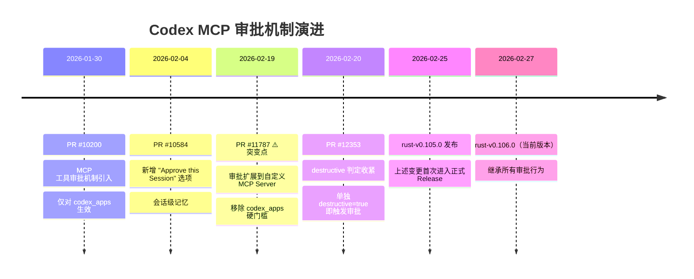
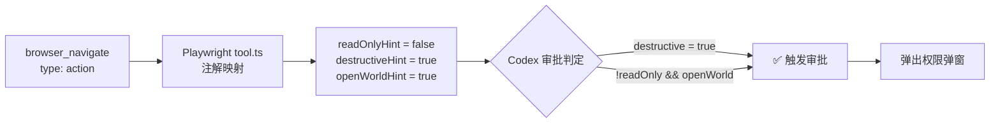

# OpenAI Codex MCP 权限审批问题分析

> **日期**：2026-02-27
> **Codex 版本**：v0.106.0
> **环境**：Windows 11, sandbox = "unelevated", Permissions: Default (workspace-write)

---

## 1. 概述

**问题**：OpenAI Codex 自 v0.105.0 起将 MCP 工具审批机制扩展到自定义 MCP Server，导致 Playwright MCP 等第三方工具在每次调用 action 类工具时频繁弹出权限审批弹窗。审批选项仅有"单次同意"和"本次会话同意"，**不存在全局永久同意配置**，除非开启高风险的 Full Access 模式。

**影响**：基于 Playwright MCP 的全自动 E2E 测试工作流被严重破坏——无法实现无人值守的自动验收。

---

## 2. 问题时间线



### 各 PR 关键变更详解

#### PR #10200（2026-01-30）— MCP 工具审批机制引入

- 首次引入 MCP tool call approval 流程
- 仅针对 `codex_apps` 场景生效
- 第三方自定义 MCP Server **不受影响**（硬编码门槛：`if server != CODEX_APPS_MCP_SERVER_NAME { return None; }`）

#### PR #10584（2026-02-04）— "Approve this Session" 选项

- 审批弹窗新增"本次会话记住"选项
- 减少同一会话内的重复审批
- 审批状态仍不跨会话持久化

#### [PR #11787](https://github.com/openai/codex/pull/11787)（2026-02-19）— ⚠️ 突变点：扩展到自定义 MCP Server

这是体感"突然变严格"的**核心变更**：

- **移除硬门槛**：删除了 `if server != CODEX_APPS_MCP_SERVER_NAME { return None; }` 的判断
- 所有自定义 MCP Server（包括 Playwright）纳入同一审批流程
- `connector_id` 从 `String` 改为 `Option<String>`，解决自定义 MCP 无法"会话记住"的问题
- 提示文案从 `"This app …"` 改为 `"The {server} MCP server …"`

#### [PR #12353](https://github.com/openai/codex/pull/12353)（2026-02-20）— destructive 判定收紧

审批触发条件变更：

| 维度 | 旧逻辑 | 新逻辑 |
|------|--------|--------|
| 判定公式 | `!read_only && (destructive \|\| open_world)` | `destructive \|\| (!read_only && open_world)` |
| `destructive=true` 单独触发 | ❌ 还需 `read_only=false` | ✅ **直接触发** |
| `read_only=true, destructive=true` | 可能放行（漏洞） | 一定审批（修复） |

---

## 3. 技术原理

### 3.1 Playwright 工具注解映射

Playwright MCP 在 [`tool.ts`](https://github.com/microsoft/playwright/blob/main/packages/playwright-core/src/mcp/sdk/tool.ts) 中定义了工具分类到 MCP 注解的映射：

```
Playwright 工具类型          →  MCP 注解
─────────────────────────────────────────────────
type: "readOnly"             →  readOnlyHint = true
type: "assertion"            →  readOnlyHint = true
type: "action"               →  readOnlyHint = false
                                destructiveHint = true
                                openWorldHint = true   (硬编码)
```

`browser_navigate` 在 [`navigate.ts`](https://github.com/microsoft/playwright/blob/main/packages/playwright-core/src/mcp/browser/tools/navigate.ts) 中定义为 `type: "action"`，因此其注解为：

```
readOnlyHint  = false
destructiveHint = true
openWorldHint = true
```

### 3.2 Codex 审批判定逻辑

Codex 在 [`mcp_tool_call.rs`](https://github.com/openai/codex/blob/main/codex-rs/core/src/mcp_tool_call.rs) 中实现审批判定：

```
需要审批 = destructive_hint == true
         OR (read_only_hint == false AND open_world_hint == true)
```

### 3.3 映射关系：为什么 Playwright 被高频触发



**关键结论**：不是 Codex 特判 Playwright，而是 Playwright 自身将 `action` 类工具标记为可变更且可外部访问，恰好命中 Codex 的审批规则。Playwright 的 `browser_navigate`、`browser_click`、`browser_type` 等常用工具全部是 `type: "action"`，因此会反复触发审批。

### 3.4 为什么其他 MCP 不受影响

其他 MCP Server 的工具可能：
- 注解为 `readOnlyHint=true`（只读工具）
- 未设置 `destructiveHint=true`
- 未设置 `openWorldHint=true`

只有同时满足 Codex 审批条件的工具才会弹窗。

---

## 4. 当前限制

| 限制 | 说明 |
|------|------|
| **无全局永久批准** | MCP 工具审批仅支持"单次"和"本会话"，没有跨会话的永久白名单 |
| **`AppToolApproval` 范围有限** | `auto/prompt/approve` 配置仅对 `codex_apps` 生效，不对自定义 MCP 生效 |
| **无"自动同意"策略** | `approval_policy.reject.mcp_elicitations=true` 只能自动**拒绝**，不能自动**同意** |
| **Full Access 是唯一的"自动批准"路径** | 但这会移除所有安全限制，风险过高 |

---

## 5. 解决方案

### 方案矩阵

| 方案 | 安全性 | 自动化程度 | 实现难度 | 推荐场景 |
|------|:------:|:----------:|:--------:|----------|
| **A: 回退到 v0.104** | ⭐⭐⭐ | ⭐⭐⭐⭐⭐ | ⭐ | 短期过渡 |
| **B: Playwright CLI 驱动** | ⭐⭐⭐⭐⭐ | ⭐⭐⭐⭐⭐ | ⭐⭐⭐ | **长期推荐** |
| **C: 长会话 + Session Approve** | ⭐⭐⭐⭐⭐ | ⭐⭐⭐ | ⭐ | 日常开发 |
| **D: 隔离容器 + Full Access** | ⭐⭐⭐⭐ | ⭐⭐⭐⭐⭐ | ⭐⭐⭐⭐ | CI/CD 环境 |
| **E: 自建/改造 MCP 注解** | ⭐⭐⭐ | ⭐⭐⭐⭐⭐ | ⭐⭐⭐⭐⭐ | 定制需求 |
| **F: MCP Annotation Proxy** | ⭐⭐⭐⭐ | ⭐⭐⭐⭐⭐ | ⭐⭐ | **当前最优** |

---

### 方案 A：回退到 v0.104

**操作**：将 Codex 降级到 `rust-v0.104.0`，该版本自定义 MCP 不走审批流程。

**优点**：
- 立即恢复无人值守 Playwright MCP 工作流
- 无需改动任何现有代码或配置
- 实施成本最低

**缺点**：
- 失去 v0.105/v0.106 的新功能和安全修复（详见[第 6 节](#6-回退-v0104-的代价评估)）
- 非长期方案，后续版本升级时问题会再次出现

**适用**：需要立即恢复自动化工作流的短期过渡场景。

---

### 方案 B：改用 Playwright CLI 驱动

**操作**：将 E2E 自动化从 MCP 工具调用改为 `playwright test` CLI 命令驱动。

**原理**：Codex 的 MCP 审批只针对 MCP 工具调用，通过 shell 命令执行 `npx playwright test` 不走 MCP 通道，因此不会触发审批。

**优点**：
- 保持 `workspace-write` 权限级别，不需要 Full Access
- 完全绕开 MCP 审批流程
- Playwright 官方也推荐 coding agent 走 CLI + Skills 路径
- 兼容未来版本升级

**缺点**：
- 需要重构现有的 MCP 调用逻辑为 CLI 脚本
- 失去 MCP 工具的实时交互能力（如逐步操作浏览器）

**适用**：**长期推荐方案**，适用于 E2E 自动化测试场景。

**参考**：[Playwright MCP README](https://github.com/microsoft/playwright-mcp) 官方建议 coding agent 优先使用 CLI 路径。

---

### 方案 C：长会话 + Session Approve

**操作**：在同一个长会话中完成所有 E2E 测试，首次调用时对每个工具选择"Approve this Session"。

**优点**：
- 无需任何代码或配置改动
- 保持完整的安全控制
- 每个工具只需首次确认一次

**缺点**：
- 每种工具首次调用仍需人工确认
- 会话结束后记忆丢失，下次需重新确认
- 无法实现完全无人值守

**适用**：日常开发和手动辅助测试场景。

---

### 方案 D：隔离容器 + Full Access

**操作**：在临时 VM 或 Docker 容器中运行 Codex，启用 Full Access 模式。

**优点**：
- 完全自动化，无任何审批弹窗
- 风险被隔离在容器环境内
- 适合 CI/CD 流水线集成

**缺点**：
- 需要搭建和维护容器化环境
- Full Access 在容器内仍然是高风险模式
- 基础设施成本较高

**适用**：CI/CD 自动化流水线、无人值守的测试环境。

---

### 方案 E：自建/改造 MCP 注解

**操作**：Fork Playwright MCP 或创建代理 MCP，修改工具注解策略，将 action 类工具的 `destructiveHint` 改为 `false`。

**优点**：
- 精准解决问题，不影响其他安全控制
- 保留 MCP 实时交互能力
- 保持最新版本 Codex

**缺点**：
- 需要维护 Fork 或代理层
- 降低了安全注解的准确性（工具实际上确实可以修改外部状态）
- 上游更新时需要同步维护
- 实现复杂度最高

**适用**：有定制化需求且愿意承担维护成本的团队。

---

### 方案 F：MCP Annotation Proxy（当前最优）

**操作**：在 Codex 和 Playwright MCP 之间部署轻量代理 `mcp-safe-proxy`，拦截 `tools/list` 响应，将工具注解重写为安全值（`readOnlyHint=true, destructiveHint=false, openWorldHint=false`），所有其他通信完全透传。

**原理**：Codex 审批判定完全依赖 MCP Server 声明的工具注解。代理将注解改为不触发审批的值，但 `tools/call`（实际操作）原样转发，功能零损失。MCP 规范明确注解是 "hints"，修改注解在协议允许范围内。

**配置变更**：仅修改 `args` 字段，在最前面插入代理包装：

```json
{
  "command": "npx",
  "args": ["-y", "mcp-safe-proxy", "--", "npx", "@playwright/mcp@latest", "--extension"],
  "env": { "PLAYWRIGHT_MCP_EXTENSION_TOKEN": "****" }
}
```

**优点**：
- 保持最新 Codex 版本 + `workspace-write` 权限级别
- 完全绕过审批，实现无人值守自动化
- 环境变量、参数、功能全部透传，无感切换
- 通用性强，可包裹任何 MCP Server
- 约 120 行代码，零外部依赖，几乎无维护成本

**缺点**：
- 多一个 Node.js 进程（~30-50MB 内存）
- 需自行构建或安装代理工具
- 降低了注解的准确性（虽然规范允许）

**适用**：**当前最优方案**。适用于需要保持最新 Codex 版本同时实现无人值守 MCP 自动化的场景。

**详细设计**：见 [mcp-safe-proxy 技术设计文档](./mcp-safe-proxy-design.md)

---

## 6. 回退 v0.104 的代价评估

### 失去的 v0.105.0 功能

来源：[rust-v0.105.0 Release](https://github.com/openai/codex/releases/tag/rust-v0.105.0)

| 功能 | 影响程度 |
|------|----------|
| TUI 主题与语法高亮 | 低 — 体验优化 |
| 语音输入支持 | 低 — 可选功能 |
| `spawn_agents_on_csv` | 中 — 批量任务能力 |
| `/copy` `/clear` `Ctrl-L` 快捷操作 | 低 — 便利性 |
| 线程恢复与搜索 | 中 — 会话管理 |
| 更多审批控制选项 | N/A — 正是问题来源 |

### 失去的 v0.106.0 功能

来源：[rust-v0.106.0 Release](https://github.com/openai/codex/releases/tag/rust-v0.106.0)

| 功能 | 影响程度 |
|------|----------|
| `request_user_input` 在 Default 模式可用 | 中 — 交互能力 |
| `js_repl` 升级 | 低 — 开发辅助 |
| Memory 选择改进 | 低 — 体验优化 |

### 失去的关键修复

| 修复 | 影响程度 |
|------|----------|
| `zsh-fork` sandbox 包裹修复 (#12800) | 高 — 稳定性 |
| 大输入防崩 (#12823) | 高 — 稳定性 |

### 评估结论

如果核心目标是"无人值守 Playwright MCP 自动化"，回退代价**中等且可接受**。关键损失在稳定性修复方面，但如果不涉及相关场景（zsh sandbox、超大输入），影响有限。

---

## 7. 后续期待

### 期望 OpenAI 提供的功能

1. **全局永久 MCP 工具白名单**
   类似 `approval_policy.allow.mcp_tools = ["playwright.*"]` 的配置，允许用户按工具名模式永久批准。

2. **Server 级别信任配置**
   按 MCP Server 维度设置信任级别，例如 `mcp_servers.playwright.trust_level = "full"`。

3. **细粒度审批策略**
   区分"本地操作"和"外部网络操作"，对仅操作 localhost 的工具降低审批要求。

4. **持久化审批记忆**
   将"Approve this Session"扩展为"Approve Always"，审批状态跨会话持久化存储。

### 可关注的上游动态

**相关 Codex Issues（均 Open，暂无官方排期）**：
- [#12716](https://github.com/openai/codex/issues/12716) — Allow list for commands（命令白名单）
- [#12281](https://github.com/openai/codex/issues/12281) — Approval menu with auto approve（自动审批菜单）
- [#4796](https://github.com/openai/codex/issues/4796) — MCP Tools whitelist（MCP 工具白名单）
- [#1260](https://github.com/openai/codex/issues/1260) — Configurable auto-approved commands（可配置自动批准）

**其他关注**：
- [Codex Releases](https://github.com/openai/codex/releases) — 关注后续版本是否新增白名单配置
- [Playwright MCP](https://github.com/microsoft/playwright-mcp) — 关注注解策略是否调整

---

## 8. 参考来源

### Pull Requests

| PR | 日期 | 说明 |
|----|------|------|
| [#10200](https://github.com/openai/codex/pull/10200) | 2026-01-30 | MCP 工具审批机制引入 |
| [#10584](https://github.com/openai/codex/pull/10584) | 2026-02-04 | "Approve this Session" 选项 |
| [#11787](https://github.com/openai/codex/pull/11787) | 2026-02-19 | 审批扩展到自定义 MCP Server |
| [#12353](https://github.com/openai/codex/pull/12353) | 2026-02-20 | destructive 判定收紧 |

### Releases

| 版本 | 日期 | 链接 |
|------|------|------|
| rust-v0.104.0 | — | [Release](https://github.com/openai/codex/releases/tag/rust-v0.104.0) |
| rust-v0.105.0 | 2026-02-25 | [Release](https://github.com/openai/codex/releases/tag/rust-v0.105.0) |
| rust-v0.106.0 | — | [Release](https://github.com/openai/codex/releases/tag/rust-v0.106.0) |

### 源码文件

| 文件 | 说明 |
|------|------|
| [`mcp_tool_call.rs`](https://github.com/openai/codex/blob/main/codex-rs/core/src/mcp_tool_call.rs) | Codex 审批判定逻辑 |
| [`connectors.rs`](https://github.com/openai/codex/blob/main/codex-rs/core/src/connectors.rs) | codex_apps 策略实现 |
| [`tool.ts`](https://github.com/microsoft/playwright/blob/main/packages/playwright-core/src/mcp/sdk/tool.ts) | Playwright 注解映射 |
| [`navigate.ts`](https://github.com/microsoft/playwright/blob/main/packages/playwright-core/src/mcp/browser/tools/navigate.ts) | browser_navigate 工具定义 |

### 其他

- [Codex 官方安全文档](https://developers.openai.com/codex/security)
- [Codex 配置参考](https://developers.openai.com/codex/config-reference)
- [Playwright MCP README](https://github.com/microsoft/playwright-mcp)
