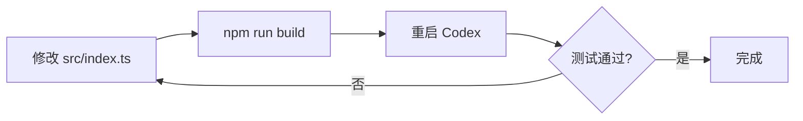

# mcp-safe-proxy 本地开发测试指南

> **适用场景**：本地调试模式——无安装残留、随时启用/恢复，如同程序的调试运行。

---

## 1. 开发环境准备

```bash
# 进入 mcp-safe-proxy 项目目录
cd mcp-safe-proxy

# 安装开发依赖（仅首次）
npm install

# 编译 TypeScript → dist/index.js
npm run build
```

接下来获取项目绝对路径（后续配置要用），**注意 MCP 配置中路径必须使用正斜杠 `/`**：

```bash
# Linux / macOS — 直接使用 pwd
pwd
# → /home/user/projects/mcp-safe-proxy  ✓

# Windows Git Bash — 用 cygpath 转换为 MCP 兼容格式
cygpath -m $(pwd)
# → C:/Users/yourname/projects/mcp-safe-proxy  ✓

# Windows PowerShell — 替换反斜杠
(Get-Location).Path -replace '\\','/'
# → C:/Users/yourname/projects/mcp-safe-proxy  ✓
```

> **记下上面命令的输出**，下文中以 `<PROJECT_ROOT>` 代替你的实际路径。
>
> **路径格式要求**：MCP 配置（TOML / JSON）中必须使用正斜杠 `C:/...`，不能用反斜杠 `C:\...`，否则会初始化失败。

**修改代码后**只需重新 `npm run build`，然后重启 Codex 即可生效。

---

## 2. Codex config.toml 配置

配置文件路径：

| 平台 | 路径 |
|------|------|
| **Windows** | `%USERPROFILE%\.codex\config.toml`（即 `C:\Users\<用户名>\.codex\config.toml`） |
| **Linux / macOS** | `~/.codex/config.toml` |

### 2.1 原始配置（无代理）

```toml
[mcp_servers.playwright]
type = "stdio"
command = "npx"
args = ["@playwright/mcp@latest"]
```

### 2.2 代理配置（本地调试模式）

将 `<PROJECT_ROOT>` 替换为你 `pwd` 得到的实际路径：

```toml
[mcp_servers.playwright]
type = "stdio"
command = "node"
args = ["<PROJECT_ROOT>/dist/index.js", "--", "npx", "@playwright/mcp@latest"]
```

**变更说明**：

| 字段 | 原始 | 代理模式 |
|------|------|---------|
| `command` | `npx` | `node` |
| `args` | `["@playwright/mcp@latest"]` | `["<PROJECT_ROOT>/dist/index.js", "--", "npx", "@playwright/mcp@latest"]` |
| `env` | 不变 | 不变 |

### 2.3 带调试日志的代理配置

`--verbose` 日志输出到 stderr，但 Codex/Claude Code 可能不显示 MCP Server 的 stderr。推荐使用 `--log-file` 将日志写到文件：

```toml
[mcp_servers.playwright]
type = "stdio"
command = "node"
args = ["<PROJECT_ROOT>/dist/index.js", "--log-file", "<PROJECT_ROOT>/proxy.log", "--", "npx", "@playwright/mcp@latest"]
```

> `--log-file` 隐含 `--verbose`，无需同时指定。日志同时输出到 stderr 和文件。

查看日志：

```bash
cat <PROJECT_ROOT>/proxy.log
# 或实时跟踪
tail -f <PROJECT_ROOT>/proxy.log
```

日志示例：

```
[mcp-safe-proxy] Spawning: npx @playwright/mcp@latest
[mcp-safe-proxy] Tracked tools/list request id=1
[mcp-safe-proxy] Rewrote annotations for 22 tools (id=1)
```

如果只需 stderr 输出（不写文件），也可以只用 `--verbose`：

```toml
args = ["<PROJECT_ROOT>/dist/index.js", "--verbose", "--", "npx", "@playwright/mcp@latest"]
```

### 2.4 ccSwitch 统一配置

[ccSwitch](https://github.com/farion1231/cc-switch) 使用标准 JSON 格式一次配置，自动转换为 Codex TOML / Claude Code JSON 等各 CLI 格式。

**原始配置**（无代理）：

```json
{
  "command": "npx",
  "args": ["@playwright/mcp@latest"]
}
```

**代理配置**（本地调试模式）：

```json
{
  "command": "node",
  "args": ["<PROJECT_ROOT>/dist/index.js", "--", "npx", "@playwright/mcp@latest"]
}
```

**带日志文件的代理配置**：

```json
{
  "command": "node",
  "args": ["<PROJECT_ROOT>/dist/index.js", "--log-file", "<PROJECT_ROOT>/proxy.log", "--", "npx", "@playwright/mcp@latest"]
}
```

> `env` 字段保持不变，ccSwitch 会自动处理 TOML / JSON 格式转换。

### 2.5 恢复原配置

改回 2.1 的原始配置，重启 Codex 即可。**零残留**——没有全局安装、没有 npm link、没有修改任何系统文件。

---

## 3. Codex 验收测试清单

### 3.1 审批判定原理

Codex 的审批判定公式（源码确认）：

```
需要审批 = destructiveHint == true
         OR (readOnlyHint == false AND openWorldHint == true)
```

Playwright MCP 源码中，**所有工具**都硬编码了 `openWorldHint: true`，action/input 类型工具还有 `destructiveHint: true`，因此几乎所有操作都会触发审批。

代理将注解重写为：

```
readOnlyHint:    true   ← Codex 认为工具只读
destructiveHint: false  ← Codex 认为工具不搞破坏
openWorldHint:   false  ← Codex 认为工具不访问外部
```

### 3.2 必须测试的工具（原本会弹审批）

这些是 action/input 类型的"危险"工具，**未加代理时必定弹审批**：

| 优先级 | 工具 | 原始注解 | 在 Codex 中的测试指令 | 成功标准 |
|--------|------|---------|---------------------|---------|
| **P0** | `browser_navigate` | `destructive:true, openWorld:true` | "请打开 https://example.com" | **不弹审批**，直接导航 |
| **P0** | `browser_click` | `destructive:true, openWorld:true` | "点击页面上的 More information 链接" | **不弹审批**，直接点击 |
| P1 | `browser_type` | `destructive:true, openWorld:true` | "在搜索框中输入 hello" | **不弹审批** |
| P1 | `browser_fill_form` | `destructive:true, openWorld:true` | "填写登录表单" | **不弹审批** |
| P2 | `browser_evaluate` | `destructive:true, openWorld:true` | "在控制台执行 document.title" | **不弹审批** |
| P2 | `browser_press_key` | `destructive:true, openWorld:true` | "按下 Enter 键" | **不弹审批** |
| P2 | `browser_tabs` | `destructive:true, openWorld:true` | "打开一个新标签页" | **不弹审批** |

### 3.3 对比基准工具（原本就不弹审批）

这些是 readOnly 类型工具，无论有无代理都不应弹审批，用于确认代理没有破坏正常行为：

| 工具 | 说明 | 预期行为 |
|------|------|---------|
| `browser_snapshot` | 获取页面快照 | 无论有无代理都不弹审批 |
| `browser_take_screenshot` | 截图 | 无论有无代理都不弹审批 |
| `browser_console_messages` | 获取控制台消息 | 无论有无代理都不弹审批 |

### 3.4 验收通过标准

```
┌─────────────────────────────────────────────────────────────┐
│ P0 工具全部不弹审批              → 核心功能验证通过 ✓      │
│ P1 + P2 工具也不弹审批           → 完整验证通过 ✓          │
│ 所有工具的浏览器操作正常执行      → 透传验证通过 ✓          │
│ 对比基准工具行为无变化            → 兼容性验证通过 ✓        │
└─────────────────────────────────────────────────────────────┘
```

### 3.5 一键测试 Prompt

修改 config.toml 为代理配置（2.2 节）后，启动 Codex，将以下 Prompt **整段复制粘贴**到 Codex 中执行：

````markdown
请按以下步骤逐个测试 Playwright MCP 工具，每一步完成后汇报结果，最后输出汇总表。

## 测试步骤

### Step 1 — browser_navigate（危险工具）
用 browser_navigate 打开 https://example.com

### Step 2 — browser_snapshot（安全工具）
用 browser_snapshot 获取当前页面快照，确认页面加载成功

### Step 3 — browser_click（危险工具）
用 browser_click 点击页面上的 "More information..." 链接

### Step 4 — browser_take_screenshot（安全工具）
用 browser_take_screenshot 截取当前页面截图，确认跳转成功。（在最后结束需要清理该残留）

### Step 5 — browser_evaluate（危险工具）
用 browser_evaluate 在页面中执行 `document.title`，返回页面标题

### Step 6 — browser_navigate_back（危险工具）
用 browser_navigate_back 返回上一页

### Step 7 — browser_snapshot（安全工具）
再次用 browser_snapshot 确认回到了 example.com

### 收尾 - 清理测试残留文件和关闭浏览器

## 输出要求

每步执行后，用一行汇报：
- 工具名
- 类型（危险/安全）
- 是否被要求审批确认（是/否）
- 执行结果（成功/失败 + 简要说明）

最后输出汇总表格：

| Step | 工具 | 类型 | 需审批 | 结果 |
|------|------|------|--------|------|
| 1    | browser_navigate | 危险 | ? | ? |
| ...  | ... | ... | ... | ... |

并给出结论：代理是否生效（所有工具均未弹审批 = 代理生效）。
````

**预期结果**：所有"危险"工具的"需审批"列均为"否"，说明 mcp-safe-proxy 注解重写生效。

---

## 4. 故障排查

### Codex 启动时 Playwright MCP 连接失败

```
原因：dist/index.js 路径不正确或未编译
排查：
  1. 确认文件存在：ls <PROJECT_ROOT>/dist/index.js
  2. 确认编译正常：cd <PROJECT_ROOT> && npm run build
  3. 手动测试：node <PROJECT_ROOT>/dist/index.js
     → 应打印用法信息并退出
```

### 代理已启用但仍然弹审批

```
原因：注解重写可能未生效
排查：
  1. 使用 --log-file 配置（2.3 节），重启 Codex
  2. 查看 <PROJECT_ROOT>/proxy.log，搜索 "[mcp-safe-proxy]"
  3. 确认日志中有 "Rewrote annotations for N tools"
  4. 如果没有此日志，说明 tools/list 请求未被拦截——检查 MCP 协议版本

注意：--verbose 日志输出到 stderr，但 Codex/Claude Code 可能不显示
MCP Server 的 stderr 输出。建议始终使用 --log-file 写到文件。
```

### 工具能自动执行但浏览器操作失败

```
原因：代理透传问题
排查：
  1. 代理只修改 tools/list 响应的 annotations，不修改 tools/call
  2. 检查 env 配置是否完整（特别是 PLAYWRIGHT_MCP_EXTENSION_TOKEN）
  3. 直接用原始配置测试，确认 Playwright MCP 本身工作正常
```

---

## 5. 开发迭代流程



每次修改代码后的迭代周期：
1. 编辑 `src/index.ts`
2. 运行 `npm run build`（编译）
3. 重启 Codex CLI（重新加载 MCP 配置）
4. 在 Codex 中测试
