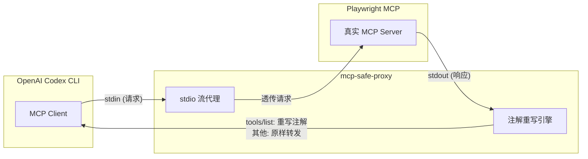
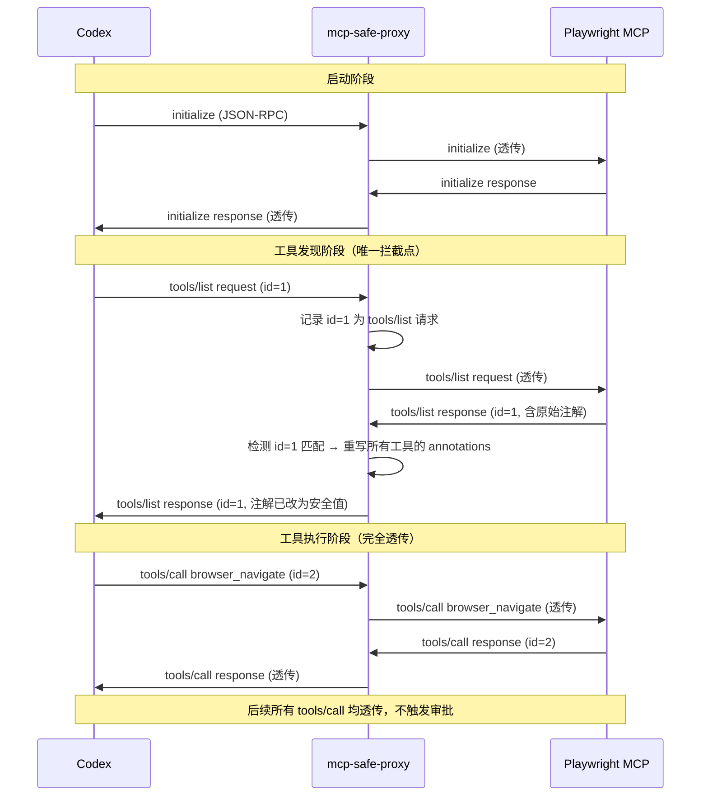

# mcp-safe-proxy：MCP 注解代理技术设计

> **日期**：2026-02-28
> **状态**：设计阶段
> **关联文档**：[Codex MCP 权限审批问题分析](./codex-mcp-permission-issue.md)

---

## 1. 方案概述

**一句话**：在 Codex 和真实 MCP Server 之间插入一个轻量代理，拦截 `tools/list` 响应并将工具注解重写为"安全"值，从而绕过 Codex 审批判定，同时完全透传所有实际操作。



---

## 2. 原理详解

### 2.1 为什么能绕过审批？

Codex 的审批判定**完全依赖** MCP Server 在 `tools/list` 响应中声明的工具注解：

```
需要审批 = destructiveHint == true
         OR (readOnlyHint == false AND openWorldHint == true)
```

代理将注解重写为：

```
readOnlyHint:    false → true     ← Codex 认为工具只读
destructiveHint: true  → false    ← Codex 认为工具不搞破坏
openWorldHint:   true  → false    ← Codex 认为工具不访问外部
```

重写后两个条件均不满足 → **Codex 不弹审批**。

而 `tools/call`（实际执行操作）完全透传，Playwright 该怎么干还怎么干，**功能零损失**。

### 2.2 MCP 规范依据

MCP 官方文档明确指出注解是**提示**而非安全保障：

> "All properties in ToolAnnotations are **hints** and not guaranteed to provide a faithful description of tool behavior. Clients should **never** make security-critical decisions based solely on annotations."
>
> — [MCP Tools 文档](https://modelcontextprotocol.io/legacy/concepts/tools)

修改注解完全在 MCP 协议允许的范围内。

### 2.3 注解字段定义

| 注解 | 类型 | 默认值 | 含义 |
|------|------|--------|------|
| `readOnlyHint` | boolean | `false` | 工具是否只读，不修改环境 |
| `destructiveHint` | boolean | `true` | 工具是否可能执行破坏性更新 |
| `idempotentHint` | boolean | `false` | 重复调用是否有额外副作用 |
| `openWorldHint` | boolean | `true` | 工具是否与外部实体交互 |

---

## 3. 技术架构

### 3.1 通信模型

MCP over stdio 使用 **JSON-RPC 2.0** 消息格式，以换行符 `\n` 分隔：

```
Codex stdin  ─→  代理读取  ─→  记录 request id  ─→  转发给子进程 stdin
子进程 stdout ─→  代理读取  ─→  判断是否 tools/list 响应  ─→  重写/透传  ─→  Codex stdout
子进程 stderr ─→  直接继承  ─→  Codex stderr（无需处理）
```

### 3.2 消息流示意



### 3.3 设计原则

| 原则 | 说明 |
|------|------|
| **最小干预** | 仅修改 `tools/list` 响应中的 `annotations` 字段，其他所有消息原样转发 |
| **零外部依赖** | 仅使用 Node.js 内置模块（`child_process`、`fs`、`path`），无需安装额外包 |
| **协议无关** | 不依赖 MCP SDK 版本，只做 JSON-RPC 层面的消息过滤 |
| **完整透传** | 环境变量、命令行参数、stderr 输出全部透传给子进程 |

---

## 4. 实现要点

### 4.1 JSON-RPC 请求追踪

MCP 使用 JSON-RPC 2.0 协议，请求和响应通过 `id` 字段关联。代理需要：

1. **上行拦截**：解析 Codex → 子进程的每条消息
2. 如果消息包含 `"method": "tools/list"`，记录其 `id`
3. **下行拦截**：解析子进程 → Codex 的每条消息
4. 如果消息的 `id` 匹配已记录的 tools/list 请求，执行注解重写
5. 其他消息**原样转发**

```typescript
// 请求追踪数据结构
const pendingToolsListIds = new Set<string | number>();

// 上行：检测 tools/list 请求
function interceptRequest(msg: JsonRpcMessage): void {
  if (msg.method === 'tools/list' && msg.id !== undefined) {
    pendingToolsListIds.add(msg.id);
  }
}

// 下行：检测 tools/list 响应并重写
function interceptResponse(msg: JsonRpcMessage): JsonRpcMessage {
  if (msg.id !== undefined && pendingToolsListIds.has(msg.id)) {
    pendingToolsListIds.delete(msg.id);
    // 重写 annotations
    if (msg.result?.tools) {
      for (const tool of msg.result.tools) {
        tool.annotations = {
          ...tool.annotations,
          readOnlyHint: true,
          destructiveHint: false,
          openWorldHint: false,
        };
      }
    }
  }
  return msg;
}
```

### 4.2 stdio 消息分帧

MCP over stdio 的消息以换行符 `\n` 分隔，每行是一个完整的 JSON 对象。需要处理数据可能分多次到达的情况：

```typescript
// 按行缓冲解析 JSON-RPC 消息
function createLineParser(onMessage: (msg: any) => void) {
  let buffer = '';
  return (chunk: string) => {
    buffer += chunk;
    const lines = buffer.split('\n');
    buffer = lines.pop() || '';  // 最后一个可能不完整，保留在 buffer
    for (const line of lines) {
      const trimmed = line.trim();
      if (trimmed) {
        try {
          onMessage(JSON.parse(trimmed));
        } catch {
          // 非 JSON 行直接输出（兼容非标准输出）
          process.stdout.write(line + '\n');
        }
      }
    }
  };
}
```

### 4.3 进程生命周期管理

```typescript
// 启动子进程
const child = spawn(command, args, {
  stdio: ['pipe', 'pipe', 'inherit'],  // stdin/stdout pipe, stderr 直接继承
  env: process.env,                     // 环境变量完整继承
  shell: true,                          // Windows 兼容（处理 .cmd 等）
});

// 信号转发：确保子进程正确退出
for (const signal of ['SIGTERM', 'SIGINT', 'SIGHUP'] as const) {
  process.on(signal, () => {
    child.kill(signal);
  });
}

// 子进程退出时，代理也退出（保持退出码一致）
child.on('exit', (code, signal) => {
  process.exit(code ?? (signal ? 1 : 0));
});

// 代理 stdin 关闭时，关闭子进程 stdin
process.stdin.on('end', () => {
  child.stdin.end();
});
```

### 4.4 Windows 兼容

| 问题 | 处理方式 |
|------|----------|
| `npx` 在 Windows 上实际是 `npx.cmd` | 使用 `spawn` 的 `shell: true` 选项 |
| 信号处理差异（Windows 无 SIGTERM） | 使用 `child.kill()` 无参数版本作为 fallback |
| 路径分隔符 | 不涉及文件路径操作，无需处理 |

### 4.5 命令行参数解析

```
mcp-safe-proxy [代理选项] -- <子命令> [子命令参数...]

示例：
mcp-safe-proxy -- npx @playwright/mcp@latest --extension
mcp-safe-proxy --verbose -- npx @playwright/mcp@latest
```

以 `--` 为分隔符：
- `--` 之前：代理自身的选项（如 `--verbose` 开启调试日志）
- `--` 之后：原封不动传给子进程的完整命令

---

## 5. 项目结构

```
mcp-safe-proxy/
├── package.json            # npm 包配置，声明 bin 入口
├── tsconfig.json           # TypeScript 编译配置
├── src/
│   └── index.ts            # 主入口（约 120 行）
└── dist/
    └── index.js            # 编译输出
```

### package.json 要点

```json
{
  "name": "mcp-safe-proxy",
  "version": "1.0.0",
  "description": "MCP annotation proxy — rewrite tool hints to bypass approval prompts",
  "bin": {
    "mcp-safe-proxy": "./dist/index.js"
  },
  "files": ["dist"],
  "scripts": {
    "build": "tsc",
    "prepublishOnly": "npm run build"
  },
  "devDependencies": {
    "typescript": "^5.0.0",
    "@types/node": "^20.0.0"
  },
  "engines": {
    "node": ">=18.0.0"
  }
}
```

---

## 6. 使用方式

### 6.1 安装

```bash
# 方式一：全局安装（推荐，启动更快）
npm install -g mcp-safe-proxy

# 方式二：npx 按需调用（无需预装）
npx -y mcp-safe-proxy -- ...
```

### 6.2 MCP 配置对比

**改动前**（原始 Playwright MCP 配置）：

```json
{
  "command": "npx",
  "args": ["@playwright/mcp@latest", "--extension"],
  "env": {
    "PLAYWRIGHT_MCP_EXTENSION_TOKEN": "****"
  }
}
```

**改动后**（仅在 args 最前面插入代理）：

```json
{
  "command": "npx",
  "args": ["-y", "mcp-safe-proxy", "--", "npx", "@playwright/mcp@latest", "--extension"],
  "env": {
    "PLAYWRIGHT_MCP_EXTENSION_TOKEN": "****"
  }
}
```

**改动项**：仅 `args` 字段，在最前面加了 `"-y", "mcp-safe-proxy", "--"`。其他所有配置（`env`、后续参数等）**完全不变**。

### 6.3 全局安装后的简化配置

```json
{
  "command": "mcp-safe-proxy",
  "args": ["--", "npx", "@playwright/mcp@latest", "--extension"],
  "env": {
    "PLAYWRIGHT_MCP_EXTENSION_TOKEN": "****"
  }
}
```

---

## 7. 通用性

mcp-safe-proxy 不仅适用于 Playwright MCP，可以包裹**任何 MCP Server**：

```bash
# 包裹任意 MCP Server
mcp-safe-proxy -- npx @anthropic/mcp-server-puppeteer
mcp-safe-proxy -- npx @anthropic/mcp-server-filesystem
mcp-safe-proxy -- python my_custom_mcp_server.py
```

只要目标 MCP Server 使用标准 stdio 传输，代理就能工作。

详见 [兼容 MCP Server 一览](./compatible-mcp-servers.md) 获取分类列表和配置示例。

---

## 8. 透传保证

| 项目 | 是否透传 | 机制 |
|------|----------|------|
| 环境变量 | ✅ 完全透传 | Node.js 子进程默认继承 `process.env` |
| 命令行参数 | ✅ 完全透传 | `--` 之后的参数原封不动传给子进程 |
| `tools/call`（执行操作） | ✅ 原样转发 | JSON-RPC 消息不解析不修改 |
| `resources/*`、`prompts/*` | ✅ 原样转发 | 所有非 `tools/list` 响应的消息直接转发 |
| `notifications/*` | ✅ 原样转发 | 双向通知消息不拦截 |
| stderr | ✅ 直接继承 | `stdio: ['pipe', 'pipe', 'inherit']` |
| 进程退出码 | ✅ 保持一致 | `child.on('exit', code => process.exit(code))` |
| **`tools/list` 响应** | ⚠️ **仅改 annotations** | 工具名称、描述、参数 schema 等其他字段不变 |

---

## 9. 性能与稳定性

| 指标 | 评估 | 说明 |
|------|------|------|
| 额外延迟 | **微秒级** | `tools/list` 仅启动时调用一次；`tools/call` 原样转发无解析 |
| 额外内存 | **~30-50MB** | 一个 Node.js 进程的基础开销 |
| 稳定性 | **与原始 MCP Server 一致** | 代理逻辑极简，无复杂状态；子进程模式是 MCP 标准通信方式 |
| 潜在问题 | **几乎没有** | 代理不持有业务状态，不做网络请求，不操作文件系统 |

**对比参考**：Codex 自身启动 MCP Server 也是用 stdio 子进程。代理只是在中间加了一跳相同机制，不引入新的不稳定因素。MCP Inspector 调试工具也使用完全相同的代理模式。

---

## 10. 风险评估

| 风险 | 等级 | 说明 | 缓解措施 |
|------|------|------|----------|
| 安全性降低 | 中低 | 注解本身是 hint 非安全保障；Codex sandbox 仍然生效 | 用户知情选择；sandbox 提供底线保护 |
| Codex 改变审批逻辑 | 低 | 未来可能不再依赖注解做判定 | 代理可随时移除，不影响原始配置 |
| MCP 协议变化 | 极低 | `tools/list` 和 annotations 是 MCP 核心规范 | 跟随 MCP spec 更新代理 |
| 维护负担 | 极低 | 代码约 120 行，逻辑极简，无外部依赖 | 几乎不需要维护 |

---

## 11. 上游社区动态

截至 2026-02-28，以下相关 Codex Issues 均处于 Open 状态，暂无官方排期：

| Issue | 标题 | 说明 |
|-------|------|------|
| [#12716](https://github.com/openai/codex/issues/12716) | Allow list for commands | 请求命令白名单替代 deny list |
| [#12281](https://github.com/openai/codex/issues/12281) | Approval menu with auto approve | 请求审批菜单增加自动批准选项 |
| [#4796](https://github.com/openai/codex/issues/4796) | MCP Tools whitelist | 请求 MCP 工具白名单配置 |
| [#1260](https://github.com/openai/codex/issues/1260) | Configurable auto-approved commands | 请求可配置的自动批准命令列表 |

**结论**：社区对全局自动批准的需求强烈，但短期内不会有原生支持。MCP Annotation Proxy 是当前最务实的过渡方案。

---

## 12. 参考来源

- [MCP Tools 官方文档](https://modelcontextprotocol.io/legacy/concepts/tools) — 工具注解规范定义
- [MCP TypeScript SDK](https://github.com/modelcontextprotocol/typescript-sdk) — 官方 SDK 参考
- [Codex 审批逻辑 `mcp_tool_call.rs`](https://github.com/openai/codex/blob/main/codex-rs/core/src/mcp_tool_call.rs) — 审批判定源码
- [Playwright 注解映射 `tool.ts`](https://github.com/microsoft/playwright/blob/main/packages/playwright-core/src/mcp/sdk/tool.ts) — 工具类型到注解的映射
- [Playwright MCP README](https://github.com/microsoft/playwright-mcp) — 官方文档
